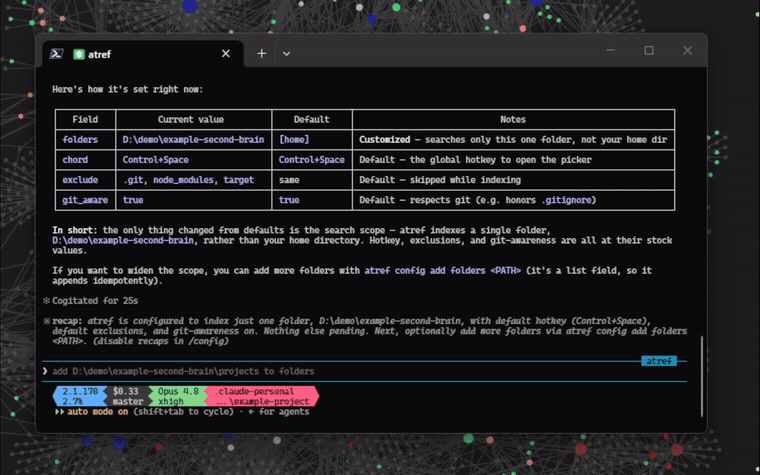
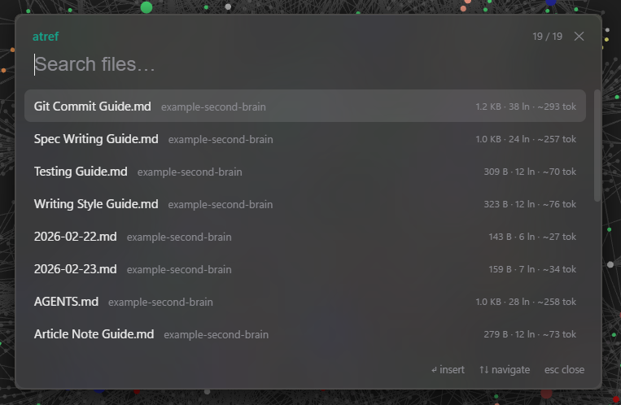
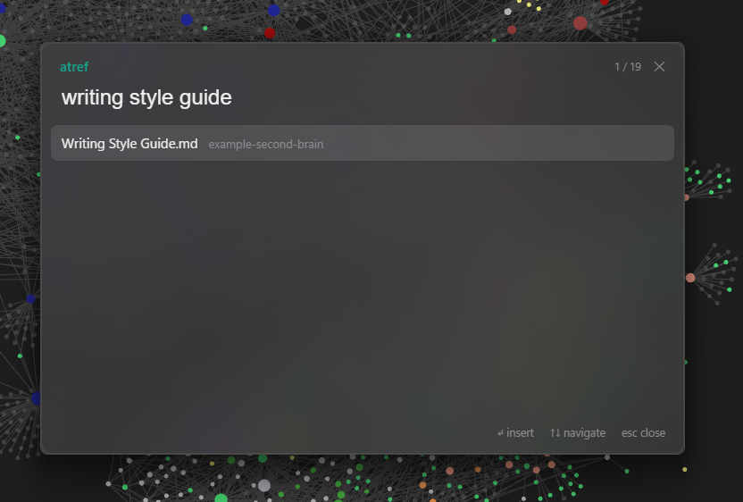

# atref

[](https://github.com/JuanjoFuchs/atref/actions/workflows/ci.yml)
[](https://github.com/JuanjoFuchs/atref/actions/workflows/release.yml)
[](https://github.com/JuanjoFuchs/atref/releases)
[](https://winstall.app/apps/JuanjoFuchs.atref)
[](https://github.com/JuanjoFuchs/atref/releases)
[](https://github.com/JuanjoFuchs/atref/releases)
[](LICENSE)

<p align="center">
  
</p>

<p align="center">
  <strong>Claude Code's <code>@</code> file picker — everywhere.</strong>
</p>

<p align="center">
  <a href="docs/demo.mp4">
    
  </a>
</p>

A global file-reference picker for Windows. Press a keyboard chord anywhere —
terminal, browser, Obsidian, chat app, IDE — and an unobtrusive fuzzy picker pops
up near the caret. Type to filter, hit **Enter**, and an `@"<absolute path>"`
reference to the selected file is inserted right where you were typing. It runs in
the system tray, and it doubles as a config CLI so agents can set it up.

> Windows-only today (it uses WebView2 + Win32 for the picker, caret, and
> insertion). macOS/Linux are a future port.

## Features

- **Summon anywhere** — a global chord (default `Ctrl+Space`) over whatever app is
  focused; **Enter** inserts `@"<absolute path>"` at the caret, **Esc** dismisses.
- **Fuzzy + frecency** — `nucleo` matching (basename-weighted, smart-case,
  CamelHumps); recent/most-used files lead an empty query and break near-equal ties.
- **Rich result rows** — the chars your query matched are highlighted (the
  ranker's own match, not a re-derivation); every row shows file size, with line
  count and a **~token estimate** (tiktoken `o200k`) filling in — what will this
  `@`-ref cost in context? — and images get an inline thumbnail.
- **Cloud-safe** — OneDrive/Dropbox cloud-only files are never content-read, so
  browsing results can't trigger downloads.
- **Multi-folder, git-aware** — index many folders, prune excludes, follow
  `.gitignore`, and a live file-watcher picks up new/changed files.
- **Instant + persistent** — an on-disk redb cache launches the picker immediately
  and reconciles against the filesystem in the background.
- **Hot-reload config** — edits to `config.json` (by hand or via the CLI) apply to
  the running app with no restart.
- **Agent config CLI** — `atref describe` / `atref config get|set|add|remove`
  configure atref from any shell; validated, atomic, JSON output.
- **Raycast-style UI** — a transparent, borderless WebView2 window with native
  acrylic (Tauri 2).

## Installation

### WinGet

```powershell
winget install JuanjoFuchs.atref
```

### Scoop

```powershell
scoop bucket add atref https://github.com/JuanjoFuchs/atref
scoop install atref
```

### PowerShell

```powershell
irm https://raw.githubusercontent.com/JuanjoFuchs/atref/main/install.ps1 | iex
```

### Direct download

Grab `atref-<version>-windows-x64.exe` from the
[latest release](https://github.com/JuanjoFuchs/atref/releases/latest) and run it.

Every path installs the same portable executable (requires the Microsoft Edge
WebView2 runtime, which ships with Windows 11).

## Quick Start

1. Launch `atref` — it lives in the system tray.
2. Press the chord (default **Ctrl+Space**) in any text field.
3. Type to fuzzy-filter your indexed files; recents lead an empty query.
4. **Enter** inserts `@"<absolute path>"` at the caret; **Esc** dismisses.

Right-click the tray icon to open the config, reload it, or quit.

**Let an agent set it up.** atref is self-describing — paste this into Claude Code:

> Run `atref describe` and configure atref to index my dev folders.

`atref describe` emits structured JSON (the command surface, the config schema,
and the config-file path), so an agent can wire up your folders via
`atref config add folders …` without you reading the rest of this README.

## Screenshots

<p align="center">
  
</p>

<p align="center"><em>Summon anywhere — an empty query leads with your recent and most-used files.</em></p>

<p align="center">
  
</p>

<p align="center"><em>Type to fuzzy-filter — "writing style guide" narrows straight to the file.</em></p>

## Configure

Config is JSON at `%APPDATA%\atref\config.json` (created on first run). Edits are
**hot-reloaded** — no restart, no manual reload:

```json
{
  "folders": ["C:\\Users\\you\\dev", "C:\\Users\\you\\vault"],
  "exclude": [".git", "node_modules", "target"],
  "chord": "Control+Space",
  "git_aware": true
}
```

| Key | Meaning |
|---|---|
| `folders` | Directories to index, recursively. |
| `exclude` | Directory names pruned during traversal. |
| `chord` | The global summon hotkey (`global-hotkey` syntax). |
| `git_aware` | Follow `.gitignore` in Git repos (skip ignored, still show untracked). |

### CLI (for agents)

The same binary is a small config CLI. Discover the surface with `atref describe`
(JSON), then mutate `config.json` — validated, atomic, and hot-reloaded by the
running app:

```powershell
atref describe                            # JSON schema of the commands + config
atref add                                 # add the current directory to folders
atref config add folders D:\proj          # add a folder
atref config set chord "Control+Alt+Space"
atref config get                          # print the current config as JSON
```

```
atref                            Launch the tray app
atref describe                   Print the command + config schema as JSON
atref config get [KEY]           Print the whole config, or one KEY, as JSON
atref config set <KEY> <VALUE>   Set a scalar field (chord, git_aware)
atref config add <KEY> <VALUE>   Add to a list field (folders, exclude)
atref config remove <KEY> <VALUE>  Remove from a list field
atref add [PATH]                 Add PATH (default: current dir) to folders
atref --version | --help
```

## Build from source

```powershell
cargo build --release    # produces target\release\atref.exe (frontend embedded)
cargo test               # headless tests (live-GUI e2e are #[ignore]d)
```

atref is built with Rust + [Tauri 2](https://tauri.app); the `ui/` frontend is
plain static HTML, embedded into the binary by `tauri-build` (no Node toolchain).

## Requirements

- Windows 10/11 (x64).
- Microsoft Edge **WebView2** runtime — preinstalled on Windows 11.

## Why

Claude Code's `@` file picker is excellent — and it only exists inside Claude
Code. atref is "that, but everywhere": cross-vault, cross-project,
cross-application, on the OS rather than inside one editor.

## License

[MIT](LICENSE)
